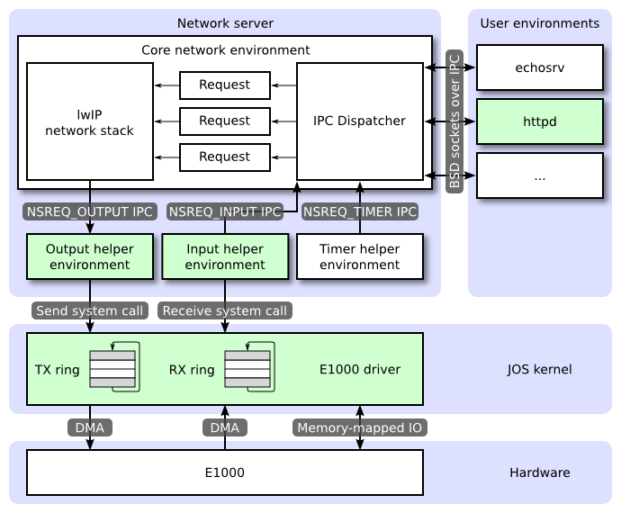
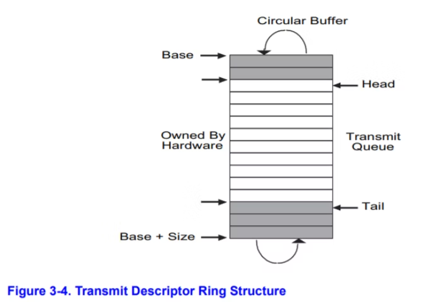
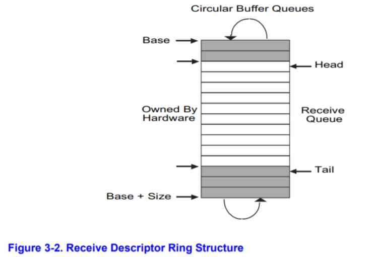

# JOS

[toc]

# PC Bootstrap

## Several Questions

- What's the first command executed when a PC boot up?
- What does BIOS do?
- What does the boot loader do?
- Why do we need to switch from real mode to protected mode?
- What's the process of the boot up?
- What's ELF format? What's .text, .rodat, .data, and .bss? What's the entry point of a program?
- How to resolve the disparity between the kernel's link address and its load address?
- How does traceback work?

## Physical Address Space

We will now dive into a bit more detail about how a PC starts up. A PC's physical address space is hard-wired to have the following general layout:

```

+------------------+  <- 0xFFFFFFFF (4GB)
|      32-bit      |
|  memory mapped   |
|     devices      |
|                  |
/\/\/\/\/\/\/\/\/\/\

/\/\/\/\/\/\/\/\/\/\
|                  |
|      Unused      |
|                  |
+------------------+  <- depends on amount of RAM
|                  |
|                  |
| Extended Memory  |
|                  |
|                  |
+------------------+  <- 0x00100000 (1MB)
|     BIOS ROM     |
+------------------+  <- 0x000F0000 (960KB)
|  16-bit devices, |
|  expansion ROMs  |
+------------------+  <- 0x000C0000 (768KB)
|   VGA Display    |
+------------------+  <- 0x000A0000 (640KB)
|                  |
|    Low Memory    |
|                  |
+------------------+  <- 0x00000000

```

The first PCs, which were based on the 16-bit Intel 8088 processor, were only capable of addressing 1MB of physical memory. The physical address space of an early PC would therefore start at 0x00000000 but end at 0x000FFFFF instead of 0xFFFFFFFF. The 640KB area marked "Low Memory" was the *only* random-access memory (RAM) that an early PC could use; in fact the very earliest PCs only could be configured with 16KB, 32KB, or 64KB of RAM!

The 384KB area from 0x000A0000 through 0x000FFFFF was reserved by the hardware for special uses such as video display buffers and firmware held in non-volatile memory. The most important part of this reserved area is the Basic Input/Output System (BIOS), which occupies the 64KB region from 0x000F0000 through 0x000FFFFF. In early PCs the BIOS was held in true read-only memory (ROM), but current PCs store the BIOS in updateable flash memory. The BIOS is responsible for performing basic system initialization such as activating the video card and checking the amount of memory installed. After performing this initialization, the BIOS loads the operating system from some appropriate location such as floppy disk, hard disk, CD-ROM, or the network, and passes control of the machine to the operating system.

When Intel finally "broke the one megabyte barrier" with the 80286 and 80386 processors, which supported 16MB and 4GB physical address spaces respectively, the PC architects nevertheless preserved the original layout for the low 1MB of physical address space in order to ensure backward compatibility with existing software. Modern PCs therefore have a "hole" in physical memory from 0x000A0000 to 0x00100000, dividing RAM into "low" or "conventional memory" (the first 640KB) and "extended memory" (everything else). In addition, some space at the very top of the PC's 32-bit physical address space, above all physical RAM, is now commonly reserved by the BIOS for use by 32-bit PCI devices.

Recent x86 processors can support *more* than 4GB of physical RAM, so RAM can extend further above 0xFFFFFFFF. In this case the BIOS must arrange to leave a *second* hole in the system's RAM at the top of the 32-bit addressable region, to leave room for these 32-bit devices to be mapped. Because of design limitations JOS will use only the first 256MB of a PC's physical memory anyway, so for now we will pretend that all PCs have "only" a 32-bit physical address space. But dealing with complicated physical address spaces and other aspects of hardware organization that evolved over many years is one of the important practical challenges of OS development.

## BIOS

is GDB's disassembly of the first instruction to be executed. From this output you can conclude a few things:

- The IBM PC starts executing at physical address 0x000ffff0, which is at the very top of the 64KB area reserved for the ROM BIOS.
- The PC starts executing with `CS = 0xf000` and `IP = 0xfff0`.
- The first instruction to be executed is a `jmp` instruction, which jumps to the segmented address `CS = 0xf000` and `IP = 0xe05b`.

Why does QEMU start like this? This is how Intel designed the 8088 processor, which IBM used in their original PC. Because the BIOS in a PC is "hard-wired" to the physical address range 0x000f0000-0x000fffff, this design ensures that the BIOS always gets control of the machine first after power-up or any system restart - which is crucial because on power-up there *is* no other software anywhere in the machine's RAM that the processor could execute. The QEMU emulator comes with its own BIOS, which it places at this location in the processor's simulated physical address space. On processor reset, the (simulated) processor enters real mode and sets CS to 0xf000 and the IP to 0xfff0, so that execution begins at that (CS:IP) segment address. How does the segmented address 0xf000:fff0 turn into a physical address?

To answer that we need to know a bit about real mode addressing. In real mode (the mode that PC starts off in), address translation works according to the formula: *physical address* = 16 * *segment* + *offset*. So, when the PC sets CS to 0xf000 and IP to 0xfff0, the physical address referenced is:

```
   16 * 0xf000 + 0xfff0   # in hex multiplication by 16 is
   = 0xf0000 + 0xfff0     # easy--just append a 0.
   = 0xffff0 
```

`0xffff0` is 16 bytes before the end of the BIOS (`0x100000`). Therefore we shouldn't be surprised that the first thing that the BIOS does is `jmp` backwards to an earlier location in the BIOS; after all how much could it accomplish in just 16 bytes?

## Boot Loader

Floppy and hard disks for PCs are divided into 512 byte regions called *sectors*. A sector is the disk's minimum transfer granularity: each read or write operation must be one or more sectors in size and aligned on a sector boundary. If the disk is bootable, the first sector is called the *boot sector*, since this is where the boot loader code resides. When the BIOS finds a bootable floppy or hard disk, it loads the 512-byte boot sector into memory at physical addresses 0x7c00 through 0x7dff, and then uses a `jmp` instruction to set the CS:IP to `0000:7c00`, passing control to the boot loader. Like the BIOS load address, these addresses are fairly arbitrary - but they are fixed and standardized for PCs.

The ability to boot from a CD-ROM came much later during the evolution of the PC, and as a result the PC architects took the opportunity to rethink the boot process slightly. As a result, the way a modern BIOS boots from a CD-ROM is a bit more complicated (and more powerful). CD-ROMs use a sector size of 2048 bytes instead of 512, and the BIOS can load a much larger boot image from the disk into memory (not just one sector) before transferring control to it. For more information, see the ["El Torito" Bootable CD-ROM Format Specification](https://pdos.csail.mit.edu/6.828/2018/readings/boot-cdrom.pdf).

For 6.828, however, we will use the conventional hard drive boot mechanism, which means that our boot loader must fit into a measly 512 bytes. The boot loader consists of one assembly language source file, `boot/boot.S`, and one C source file, `boot/main.c` Look through these source files carefully and make sure you understand what's going on. The boot loader must perform two main functions:

1. First, the boot loader switches the processor from real mode to *32-bit protected mode*, because it is only in this mode that software can access all the memory above 1MB in the processor's physical address space. Protected mode is described briefly in sections 1.2.7 and 1.2.8 of [PC Assembly Language](https://pdos.csail.mit.edu/6.828/2018/readings/pcasm-book.pdf), and in great detail in the Intel architecture manuals. At this point you only have to understand that translation of segmented addresses (segment:offset pairs) into physical addresses happens differently in protected mode, and that after the transition offsets are 32 bits instead of 16.
2. Second, the boot loader reads the kernel from the hard disk by directly accessing the IDE disk device registers via the x86's special I/O instructions. If you would like to understand better what the particular I/O instructions here mean, check out the "IDE hard drive controller" section on [the 6.828 reference page](https://pdos.csail.mit.edu/6.828/2018/reference.html). You will not need to learn much about programming specific devices in this class: writing device drivers is in practice a very important part of OS development, but from a conceptual or architectural viewpoint it is also one of the least interesting.

[./boot/boot.S](./boot/boot.S)

```assembly
#include <inc/mmu.h>

# Start the CPU: switch to 32-bit protected mode, jump into C.
# The BIOS loads this code from the first sector of the hard disk into
# memory at physical address 0x7c00 and starts executing in real mode
# with %cs=0 %ip=7c00.

.set PROT_MODE_CSEG, 0x8         # kernel code segment selector
.set PROT_MODE_DSEG, 0x10        # kernel data segment selector
.set CR0_PE_ON,      0x1         # protected mode enable flag

.globl start
start:
  .code16                     # Assemble for 16-bit mode
  cli                         # Disable interrupts
  cld                         # String operations increment

  # Set up the important data segment registers (DS, ES, SS).
  xorw    %ax,%ax             # Segment number zero
  movw    %ax,%ds             # -> Data Segment
  movw    %ax,%es             # -> Extra Segment
  movw    %ax,%ss             # -> Stack Segment

  # Enable A20:
  #   For backwards compatibility with the earliest PCs, physical
  #   address line 20 is tied low, so that addresses higher than
  #   1MB wrap around to zero by default.  This code undoes this.
seta20.1:
  inb     $0x64,%al               # Wait for not busy
  testb   $0x2,%al
  jnz     seta20.1

  movb    $0xd1,%al               # 0xd1 -> port 0x64
  outb    %al,$0x64

seta20.2:
  inb     $0x64,%al               # Wait for not busy
  testb   $0x2,%al
  jnz     seta20.2

  movb    $0xdf,%al               # 0xdf -> port 0x60
  outb    %al,$0x60

  # Switch from real to protected mode, using a bootstrap GDT
  # and segment translation that makes virtual addresses 
  # identical to their physical addresses, so that the 
  # effective memory map does not change during the switch.
  lgdt    gdtdesc
  movl    %cr0, %eax
  orl     $CR0_PE_ON, %eax
  movl    %eax, %cr0
  
  # Jump to next instruction, but in 32-bit code segment.
  # Switches processor into 32-bit mode.
  ljmp    $PROT_MODE_CSEG, $protcseg

  .code32                     # Assemble for 32-bit mode
protcseg:
  # Set up the protected-mode data segment registers
  movw    $PROT_MODE_DSEG, %ax    # Our data segment selector
  movw    %ax, %ds                # -> DS: Data Segment
  movw    %ax, %es                # -> ES: Extra Segment
  movw    %ax, %fs                # -> FS
  movw    %ax, %gs                # -> GS
  movw    %ax, %ss                # -> SS: Stack Segment
  
  # Set up the stack pointer and call into C.
  movl    $start, %esp
  call bootmain

  # If bootmain returns (it shouldn't), loop.
spin:
  jmp spin

# Bootstrap GDT
.p2align 2                                # force 4 byte alignment
gdt:
  SEG_NULL           # null seg
  SEG(STA_X|STA_R, 0x0, 0xffffffff) # code seg
  SEG(STA_W, 0x0, 0xffffffff)           # data seg

gdtdesc:
  .word   0x17                            # sizeof(gdt) - 1
  .long   gdt                             # address gdt
```

[kern/entry.S](kern/entry.S)

```assembly
/* See COPYRIGHT for copyright information. */

#include <inc/mmu.h>
#include <inc/memlayout.h>
#include <inc/trap.h>

# Shift Right Logical 
#define SRL(val, shamt)    (((val) >> (shamt)) & ~(-1 << (32 - (shamt))))


###################################################################
# The kernel (this code) is linked at address ~(KERNBASE + 1 Meg), 
# but the bootloader loads it at address ~1 Meg.
#   
# RELOC(x) maps a symbol x from its link address to its actual
# location in physical memory (its load address).    
###################################################################

#define RELOC(x) ((x) - KERNBASE)

#define MULTIBOOT_HEADER_MAGIC (0x1BADB002)
#define MULTIBOOT_HEADER_FLAGS (0)
#define CHECKSUM (-(MULTIBOOT_HEADER_MAGIC + MULTIBOOT_HEADER_FLAGS))

###################################################################
# entry point
###################################################################

.text

# The Multiboot header
.align 4
.long MULTIBOOT_HEADER_MAGIC
.long MULTIBOOT_HEADER_FLAGS
.long CHECKSUM

# '_start' specifies the ELF entry point.  Since we haven't set up
# virtual memory when the bootloader enters this code, we need the
# bootloader to jump to the *physical* address of the entry point.
.globl     _start
_start = RELOC(entry)

.globl entry
entry:
    movw   $0x1234,0x472        # warm boot

    # We haven't set up virtual memory yet, so we're running from
    # the physical address the boot loader loaded the kernel at: 1MB
    # (plus a few bytes).  However, the C code is linked to run at
    # KERNBASE+1MB.  Hence, we set up a trivial page directory that
    # translates virtual addresses [KERNBASE, KERNBASE+4MB) to
    # physical addresses [0, 4MB).  This 4MB region will be
    # sufficient until we set up our real page table in mem_init
    # in lab 2.

    # Load the physical address of entry_pgdir into cr3.  entry_pgdir
    # is defined in entrypgdir.c.
    movl   $(RELOC(entry_pgdir)), %eax
    movl   %eax, %cr3
    # Turn on paging.
    movl   %cr0, %eax
    orl    $(CR0_PE|CR0_PG|CR0_WP), %eax
    movl   %eax, %cr0

    # Now paging is enabled, but we're still running at a low EIP
    # (why is this okay?).  Jump up above KERNBASE before entering
    # C code.
    mov    $relocated, %eax
    jmp    *%eax
relocated:

    # Clear the frame pointer register (EBP)
    # so that once we get into debugging C code,
    # stack backtraces will be terminated properly.
    movl   $0x0,%ebp        # nuke frame pointer

    # Set the stack pointer
    movl   $(bootstacktop),%esp

    # now to C code
    call   i386_init

    # Should never get here, but in case we do, just spin.
spin:   jmp    spin


.data
###################################################################
# boot stack
###################################################################
    .p2align   PGSHIFT       # force page alignment
    .globl    bootstack
bootstack:
    .space    KSTKSIZE
    .globl    bootstacktop   
bootstacktop:
```

[boot/main.c](boot/main.c)

```c
/**********************************************************************
 * This a dirt simple boot loader, whose sole job is to boot
 * an ELF kernel image from the first IDE hard disk.
 *
 * DISK LAYOUT
 *  * This program(boot.S and main.c) is the bootloader.  It should
 *    be stored in the first sector of the disk.
 *
 *  * The 2nd sector onward holds the kernel image.
 *
 *  * The kernel image must be in ELF format.
 *
 * BOOT UP STEPS
 *  * when the CPU boots it loads the BIOS into memory and executes it
 *
 *  * the BIOS intializes devices, sets of the interrupt routines, and
 *    reads the first sector of the boot device(e.g., hard-drive)
 *    into memory and jumps to it.
 *
 *  * Assuming this boot loader is stored in the first sector of the
 *    hard-drive, this code takes over...
 *
 *  * control starts in boot.S -- which sets up protected mode,
 *    and a stack so C code then run, then calls bootmain()
 *
 *  * bootmain() in this file takes over, reads in the kernel and jumps to it.
 **********************************************************************/

#define SECTSIZE    512
#define ELFHDR     ((struct Elf *) 0x10000) // scratch space

void readsect(void*, uint32_t);
void readseg(uint32_t, uint32_t, uint32_t);

void
bootmain(void)
{
    struct Proghdr *ph, *eph;
    int i;

    // read 1st page off disk
    readseg((uint32_t) ELFHDR, SECTSIZE*8, 0);

    // is this a valid ELF?
    if (ELFHDR->e_magic != ELF_MAGIC)
       goto bad;

    // load each program segment (ignores ph flags)
    ph = (struct Proghdr *) ((uint8_t *) ELFHDR + ELFHDR->e_phoff);
    eph = ph + ELFHDR->e_phnum;
    for (; ph < eph; ph++) {
       // p_pa is the load address of this segment (as well
       // as the physical address)
       readseg(ph->p_pa, ph->p_memsz, ph->p_offset);
       for (i = 0; i < ph->p_memsz - ph->p_filesz; i++) {
          *((char *) ph->p_pa + ph->p_filesz + i) = 0;
       }
    }

    // call the entry point from the ELF header
    // note: does not return!
    ((void (*)(void)) (ELFHDR->e_entry))();

bad:
    outw(0x8A00, 0x8A00);
    outw(0x8A00, 0x8E00);
    while (1)
       /* do nothing */;
}
```

## ELF

To make sense out of `boot/main.c` you'll need to know what an ELF binary is. When you compile and link a C program such as the JOS kernel, the compiler transforms each C source ('`.c`') file into an *object* ('`.o`') file containing assembly language instructions encoded in the binary format expected by the hardware. The linker then combines all of the compiled object files into a single *binary image* such as `obj/kern/kernel`, which in this case is a binary in the ELF format, which stands for "Executable and Linkable Format".

Full information about this format is available in [the ELF specification](https://pdos.csail.mit.edu/6.828/2018/readings/elf.pdf) on [our reference page](https://pdos.csail.mit.edu/6.828/2018/reference.html), but you will not need to delve very deeply into the details of this format in this class. Although as a whole the format is quite powerful and complex, most of the complex parts are for supporting dynamic loading of shared libraries, which we will not do in this class. The [Wikipedia page](http://en.wikipedia.org/wiki/Executable_and_Linkable_Format) has a short description.

For purposes of 6.828, you can consider an ELF executable to be a header with loading information, followed by several *program sections*, each of which is a contiguous chunk of code or data intended to be loaded into memory at a specified address. The boot loader does not modify the code or data; it loads it into memory and starts executing it.

An ELF binary starts with a fixed-length *ELF header*, followed by a variable-length *program header* listing each of the program sections to be loaded. The C definitions for these ELF headers are in `inc/elf.h`. The program sections we're interested in are:

- `.text`: The program's executable instructions.
- `.rodata`: Read-only data, such as ASCII string constants produced by the C compiler. (We will not bother setting up the hardware to prohibit writing, however.)
- `.data`: The data section holds the program's initialized data, such as global variables declared with initializers like `int x = 5;`.

When the linker computes the memory layout of a program, it reserves space for *uninitialized* global variables, such as `int x;`, in a section called `.bss` that immediately follows `.data` in memory. C requires that "uninitialized" global variables start with a value of zero. Thus there is no need to store contents for `.bss` in the ELF binary; instead, the linker records just the address and size of the `.bss` section. The loader or the program itself must arrange to zero the `.bss` section.

The link address of a section is the memory address from which the section expects to execute. The linker encodes the link address in the binary in various ways, such as when the code needs the address of a global variable, with the result that a binary usually won't work if it is executing from an address that it is not linked for. (It is possible to generate *position-independent* code that does not contain any such absolute addresses. This is used extensively by modern shared libraries, but it has performance and complexity costs, so we won't be using it in 6.828.)

The program headers are then listed under "Program Headers" in the output of objdump. The areas of the ELF object that need to be loaded into memory are those that are marked as "LOAD". Other information for each program header is given, such as the virtual address ("vaddr"), the physical address ("paddr"), and the size of the loaded area ("memsz" and "filesz").

Back in boot/main.c, the `ph->p_pa` field of each program header contains the segment's destination physical address (in this case, it really is a physical address, though the ELF specification is vague on the actual meaning of this field).

The BIOS loads the boot sector into memory starting at address 0x7c00, so this is the boot sector's load address. This is also where the boot sector executes from, so this is also its link address. We set the link address by passing `-Ttext 0x7C00` to the linker in `boot/Makefrag`, so the linker will produce the correct memory addresses in the generated code.

## Position Dependence

When you inspected the boot loader's link and load addresses above, they matched perfectly, but there was a (rather large) disparity between the *kernel's* link address (as printed by objdump) and its load address. Go back and check both and make sure you can see what we're talking about. (Linking the kernel is more complicated than the boot loader, so the link and load addresses are at the top of `kern/kernel.ld`.)

Operating system kernels often like to be linked and run at very high *virtual address*, such as 0xf0100000, in order to leave the lower part of the processor's virtual address space for user programs to use. The reason for this arrangement will become clearer in the next lab.

Many machines don't have any physical memory at address 0xf0100000, so we can't count on being able to store the kernel there. Instead, we will use the processor's memory management hardware to map virtual address 0xf0100000 (the link address at which the kernel code *expects* to run) to physical address 0x00100000 (where the boot loader loaded the kernel into physical memory). This way, although the kernel's virtual address is high enough to leave plenty of address space for user processes, it will be loaded in physical memory at the 1MB point in the PC's RAM, just above the BIOS ROM. This approach requires that the PC have at least a few megabytes of physical memory (so that physical address 0x00100000 works), but this is likely to be true of any PC built after about 1990.

In fact, in the next lab, we will map the *entire* bottom 256MB of the PC's physical address space, from physical addresses 0x00000000 through 0x0fffffff, to virtual addresses 0xf0000000 through 0xffffffff respectively. You should now see why JOS can only use the first 256MB of physical memory.

For now, we'll just map the first 4MB of physical memory, which will be enough to get us up and running. We do this using the hand-written, statically-initialized page directory and page table in `kern/entrypgdir.c`. For now, you don't have to understand the details of how this works, just the effect that it accomplishes. Up until `kern/entry.S` sets the `CR0_PG` flag, memory references are treated as physical addresses (strictly speaking, they're linear addresses, but boot/boot.S set up an identity mapping from linear addresses to physical addresses and we're never going to change that). Once `CR0_PG` is set, memory references are virtual addresses that get translated by the virtual memory hardware to physical addresses. `entry_pgdir` translates virtual addresses in the range 0xf0000000 through 0xf0400000 to physical addresses 0x00000000 through 0x00400000, as well as virtual addresses 0x00000000 through 0x00400000 to physical addresses 0x00000000 through 0x00400000. Any virtual address that is not in one of these two ranges will cause a hardware exception which, since we haven't set up interrupt handling yet, will cause QEMU to dump the machine state and exit (or endlessly reboot if you aren't using the 6.828-patched version of QEMU).

## Stack and Traceback

The x86 stack pointer (`esp` register) points to the lowest location on the stack that is currently in use. Everything *below* that location in the region reserved for the stack is free. Pushing a value onto the stack involves decreasing the stack pointer and then writing the value to the place the stack pointer points to. Popping a value from the stack involves reading the value the stack pointer points to and then increasing the stack pointer. In 32-bit mode, the stack can only hold 32-bit values, and esp is always divisible by four. Various x86 instructions, such as `call`, are "hard-wired" to use the stack pointer register.

The `ebp` (base pointer) register, in contrast, is associated with the stack primarily by software convention. On entry to a C function, the function's *prologue* code normally saves the previous function's base pointer by pushing it onto the stack, and then copies the current `esp` value into `ebp` for the duration of the function. If all the functions in a program obey this convention, then at any given point during the program's execution, it is possible to trace back through the stack by following the chain of saved `ebp` pointers and determining exactly what nested sequence of function calls caused this particular point in the program to be reached. This capability can be particularly useful, for example, when a particular function causes an `assert` failure or `panic` because bad arguments were passed to it, but you aren't sure *who* passed the bad arguments. A stack backtrace lets you find the offending function.

The stack structure is like this:

```
              4               0
              +---------------+ HIGH
              | saved %ebp    | <---+
              | saved %esi    |     |
stack frame 0 | arg 4 (%ebx)  |     |
              | arg 3         |     |
              | arg 2         |     |
              | arg 1 (%esi)? |     |
              | arg 0 (%eax)  |     |
              | saved %eip    |     |
              +---------------+     |
    %ebp ---> | saved %ebp    | <---+
              | saved %esi    |     |
stack frame x | arg 4 (%ebx)  |     |
              | arg 3         |     |
              | arg 2         |     |
              | arg 1 (%esi)? |     |
              | arg 0 (%eax)  |     |
              | saved %eip    |     |
              +---------------+     |
    %ebp ---> | saved %ebp    | ----+
              | something     |
    %esp ---> +---------------+ LOW

```

In `kern/kern.ld`, we can find that `__STAB_*` points to the `.stab` section of the elf file which contains the debugging information, as known as the symbol table. It was linked to the kernel and loaded to the kernel memory. The output of `objdump -h obj/kern/kernel` command shows that the kernel does contain a `.stab` and a `.stabstr` section
and `objdump -G obj/kern/kernel` command will print the symbol table out. So `debuginfo_eip()` can read debugging information like function names from the `.stab` section and that's why `__STAB_*` is used.

In `kern/kdebug.c`, we notice that `debuginfo_eip()` uses a `struct Eipdebuginfo` structure to pass the information we want, and the struct was defined in `kern/kdebug.c` like that.

```
// Debug information about a particular instruction pointer
struct Eipdebuginfo {
	const char *eip_file;		// Source code filename for EIP
	int eip_line;			// Source code linenumber for EIP

	const char *eip_fn_name;	// Name of function containing EIP
					//  - Note: not null terminated!
	int eip_fn_namelen;		// Length of function name
	uintptr_t eip_fn_addr;		// Address of start of function
	int eip_fn_narg;		// Number of function arguments
};
```

Noticed that `eip_fn_name` is not a null-terminated string, the lab page hinted that we can use `printf("%.*s", length, string)` to print non-null-terminated strings.

# Memory Management

## Physical Memory Management

Physical memory is managed by pages. Physical pages are managed by the kernel using the `struct PageInfo` structure.
The kernel keeps an array of `struct PageInfo` to keep track of all the physical pages.
The kernel also keeps a linked list of free pages that can be allocated.

```c
// These variables are set in mem_init()
pde_t *kern_pgdir;		// Kernel's initial page directory
struct PageInfo *pages;		// Physical page state array
static struct PageInfo *page_free_list;	// Free list of physical pages
```

```c
/*
 * Page descriptor structures, mapped at UPAGES.
 * Read/write to the kernel, read-only to user programs.
 *
 * Each struct PageInfo stores metadata for one physical page.
 * Is it NOT the physical page itself, but there is a one-to-one
 * correspondence between physical pages and struct PageInfo's.
 * You can map a struct PageInfo * to the corresponding physical address
 * with page2pa() in kern/pmap.h.
 */
struct PageInfo {
	// Next page on the free list.
	struct PageInfo *pp_link;

	// pp_ref is the count of pointers (usually in page table entries)
	// to this page, for pages allocated using page_alloc.
	// Pages allocated at boot time using pmap.c's
	// boot_alloc do not have valid reference count fields.

	uint16_t pp_ref;
};
```


### Allocation before initializing the page free list
Before allocating the physical pages using the free list,
we need to allocate the memory for the PageInfo in the free list.
To do the self-lifting, we use a simple allocator called `boot_alloc`
that allocates memory by numerically incrementing a global variable `nextfree`.
```c
static void *
boot_alloc(uint32_t n)
{
	static char *nextfree;	// virtual address of next byte of free memory
	char *result;

	// Initialize nextfree if this is the first time.
	// 'end' is a magic symbol automatically generated by the linker,
	// which points to the end of the kernel's bss segment:
	// the first virtual address that the linker did *not* assign
	// to any kernel code or global variables.
	if (!nextfree) {
		extern char end[];
		nextfree = ROUNDUP((char *) end, PGSIZE);
	}

	// Allocate a chunk large enough to hold 'n' bytes, then update
	// nextfree.  Make sure nextfree is kept aligned
	// to a multiple of PGSIZE.
	//
	// LAB 2: Your code here.
    if(n == 0) {
        return nextfree;
    }else if(n > 0) {
        result = nextfree;
        nextfree += ROUNDUP(n, PGSIZE);
        return result;
    }

	return NULL;
}
```

### Initialization
Initialize page structure and memory free list.
```c
	//////////////////////////////////////////////////////////////////////
    // Allocate an array of npages 'struct PageInfo's and store it in 'pages'.
    // The kernel uses this array to keep track of physical pages: for
    // each physical page, there is a corresponding struct PageInfo in this
    // array.  'npages' is the number of physical pages in memory.  Use memset
    // to initialize all fields of each struct PageInfo to 0.
    // Your code goes here:
    pages = (struct PageInfo *) boot_alloc(npages * sizeof(struct PageInfo));
    memset(pages, 0, npages * sizeof(struct PageInfo));
```
```c
	//////////////////////////////////////////////////////////////////////
	// Now that we've allocated the initial kernel data structures, we set
	// up the list of free physical pages. Once we've done so, all further
	// memory management will go through the page_* functions. In
	// particular, we can now map memory using boot_map_region
	// or page_insert
	page_init();
```

```c
void
page_init(void)
{
	// The example code here marks all physical pages as free.
	// However this is not truly the case.  What memory is free?
	//  1) Mark physical page 0 as in use.
	//     This way we preserve the real-mode IDT and BIOS structures
	//     in case we ever need them.  (Currently we don't, but...)
	//  2) The rest of base memory, [PGSIZE, npages_basemem * PGSIZE)
	//     is free.
	//  3) Then comes the IO hole [IOPHYSMEM, EXTPHYSMEM), which must
	//     never be allocated.
	//  4) Then extended memory [EXTPHYSMEM, ...).
	//     Some of it is in use, some is free. Where is the kernel
	//     in physical memory?  Which pages are already in use for
	//     page tables and other data structures?
	//
	// Change the code to reflect this.
	// NB: DO NOT actually touch the physical memory corresponding to
	// free pages!
    pages[0].pp_ref = 1;
    pages[0].pp_link = NULL;

    for(int i = 1; i < npages_basemem; i++) {
        pages[i].pp_ref = 0;
        pages[i].pp_link = page_free_list;
        page_free_list = &pages[i];
    }

    for(int i = IOPHYSMEM / PGSIZE; i < EXTPHYSMEM / PGSIZE; i++) {
        pages[i].pp_ref = 1;
        pages[i].pp_link = NULL;
    }

    int boot_alloc_end = PADDR(boot_alloc(0)) / PGSIZE;
    for(int i = EXTPHYSMEM / PGSIZE; i < boot_alloc_end; i++) {
        pages[i].pp_ref = 1;
        pages[i].pp_link = NULL;
    }

    for(int i = boot_alloc_end; i < npages; i++) {
        pages[i].pp_ref = 0;
        pages[i].pp_link = page_free_list;
        page_free_list = &pages[i];
    }
}
```


### Allocation after initializing the page free list
To allocate a page, we need to remove a page from the free list.
```c
struct PageInfo *
page_alloc(int alloc_flags)
{
	// Fill this function in
    struct PageInfo* free_page = page_free_list;
    if(free_page == NULL) {
        return NULL;
    }
    page_free_list = free_page->pp_link;
    free_page->pp_link = NULL;

    if(alloc_flags & ALLOC_ZERO) {
        memset(page2kva(free_page), 0, PGSIZE);
    }
	return free_page;
}
```

### Freeing
When a physical page is no longer in use, we need to decrement the reference count of the page
so that the page can be freed when the reference count reaches 0.
```c
void
page_decref(struct PageInfo* pp)
{
	if (--pp->pp_ref == 0)
		page_free(pp);
}

```
To free a page, we need to return the page to the free list.
```c
//
// Return a page to the free list.
// (This function should only be called when pp->pp_ref reaches 0.)
//
void
page_free(struct PageInfo *pp)
{
	// Fill this function in
	// Hint: You may want to panic if pp->pp_ref is nonzero or
	// pp->pp_link is not NULL.
    if(pp->pp_ref != 0 || pp->pp_link != NULL) {
        panic("page_free: pp->pp_ref != 0 || pp->pp_link != NULL");
    }

    pp->pp_link = page_free_list;
    page_free_list = pp;
}
```


## Virtual Memory Management

In x86 terminology, a *virtual address* consists of a segment selector and an offset within the segment. A *linear address* is what you get after segment translation but before page translation. A *physical address* is what you finally get after both segment and page translation and what ultimately goes out on the hardware bus to your RAM.

```

           Selector  +--------------+         +-----------+
          ---------->|              |         |           |
                     | Segmentation |         |  Paging   |
Software             |              |-------->|           |---------->  RAM
            Offset   |  Mechanism   |         | Mechanism |
          ---------->|              |         |           |
                     +--------------+         +-----------+
            Virtual                   Linear                Physical
```


### Layout

Every process has its own virtual address space.
The whole virtual address space is divided into kernel space and user space.
Both of them can be divided into many virtual pages.
To read or write data in a virtual page, process usually needs to give a linear address that consists of a segment base and an offset.
Adding the segment base to the offset gives the logical address of the data.
Then the logical address is translated to a physical address using the 2-level page table.

The following is a general virtual memory layout of a process in JOS.

```c

/*
 * Virtual memory map:                                Permissions
 *                                                    kernel/user
 *
 *    4 Gig -------->  +------------------------------+
 *                     |                              | RW/--
 *                     ~~~~~~~~~~~~~~~~~~~~~~~~~~~~~~~~
 *                     :              .               :
 *                     :              .               :
 *                     :              .               :
 *                     |~~~~~~~~~~~~~~~~~~~~~~~~~~~~~~| RW/--
 *                     |                              | RW/--
 *                     |   Remapped Physical Memory   | RW/--
 *                     |                              | RW/--
 *    KERNBASE, ---->  +------------------------------+ 0xf0000000      --+
 *    KSTACKTOP        |     CPU0's Kernel Stack      | RW/--  KSTKSIZE   |
 *                     | - - - - - - - - - - - - - - -|                   |
 *                     |      Invalid Memory (*)      | --/--  KSTKGAP    |
 *                     +------------------------------+                   |
 *                     |     CPU1's Kernel Stack      | RW/--  KSTKSIZE   |
 *                     | - - - - - - - - - - - - - - -|                 PTSIZE
 *                     |      Invalid Memory (*)      | --/--  KSTKGAP    |
 *                     +------------------------------+                   |
 *                     :              .               :                   |
 *                     :              .               :                   |
 *    MMIOLIM ------>  +------------------------------+ 0xefc00000      --+
 *                     |       Memory-mapped I/O      | RW/--  PTSIZE
 * ULIM, MMIOBASE -->  +------------------------------+ 0xef800000
 *                     |  Cur. Page Table (User R-)   | R-/R-  PTSIZE
 *    UVPT      ---->  +------------------------------+ 0xef400000
 *                     |          RO PAGES            | R-/R-  PTSIZE
 *    UPAGES    ---->  +------------------------------+ 0xef000000
 *                     |           RO ENVS            | R-/R-  PTSIZE
 * UTOP,UENVS ------>  +------------------------------+ 0xeec00000
 * UXSTACKTOP -/       |     User Exception Stack     | RW/RW  PGSIZE
 *                     +------------------------------+ 0xeebff000
 *                     |       Empty Memory (*)       | --/--  PGSIZE
 *    USTACKTOP  --->  +------------------------------+ 0xeebfe000
 *                     |      Normal User Stack       | RW/RW  PGSIZE
 *                     +------------------------------+ 0xeebfd000
 *                     |                              |
 *                     |                              |
 *                     ~~~~~~~~~~~~~~~~~~~~~~~~~~~~~~~~
 *                     .                              .
 *                     .                              .
 *                     .                              .
 *                     |~~~~~~~~~~~~~~~~~~~~~~~~~~~~~~|
 *                     |     Program Data & Heap      |
 *    UTEXT -------->  +------------------------------+ 0x00800000
 *    PFTEMP ------->  |       Empty Memory (*)       |        PTSIZE
 *                     |                              |
 *    UTEMP -------->  +------------------------------+ 0x00400000      --+
 *                     |       Empty Memory (*)       |                   |
 *                     | - - - - - - - - - - - - - - -|                   |
 *                     |  User STAB Data (optional)   |                 PTSIZE
 *    USTABDATA ---->  +------------------------------+ 0x00200000        |
 *                     |       Empty Memory (*)       |                   |
 *    0 ------------>  +------------------------------+                 --+
 *
 * (*) Note: The kernel ensures that "Invalid Memory" is *never* mapped.
 *     "Empty Memory" is normally unmapped, but user programs may map pages
 *     there if desired.  JOS user programs map pages temporarily at UTEMP.
 */


// All physical memory mapped at this address
#define	KERNBASE	0xF0000000

// At IOPHYSMEM (640K) there is a 384K hole for I/O.  From the kernel,
// IOPHYSMEM can be addressed at KERNBASE + IOPHYSMEM.  The hole ends
// at physical address EXTPHYSMEM.
#define IOPHYSMEM	0x0A0000
#define EXTPHYSMEM	0x100000

// Kernel stack.
#define KSTACKTOP	KERNBASE
#define KSTKSIZE	(8*PGSIZE)   		// size of a kernel stack
#define KSTKGAP		(8*PGSIZE)   		// size of a kernel stack guard

// Memory-mapped IO.
#define MMIOLIM		(KSTACKTOP - PTSIZE)
#define MMIOBASE	(MMIOLIM - PTSIZE)

#define ULIM		(MMIOBASE)

/*
 * User read-only mappings! Anything below here til UTOP are readonly to user.
 * They are global pages mapped in at env allocation time.
 */

// User read-only virtual page table (see 'uvpt' below)
#define UVPT		(ULIM - PTSIZE)
// Read-only copies of the Page structures
#define UPAGES		(UVPT - PTSIZE)
// Read-only copies of the global env structures
#define UENVS		(UPAGES - PTSIZE)

/*
 * Top of user VM. User can manipulate VA from UTOP-1 and down!
 */

// Top of user-accessible VM
#define UTOP		UENVS
// Top of one-page user exception stack
#define UXSTACKTOP	UTOP
// Next page left invalid to guard against exception stack overflow; then:
// Top of normal user stack
#define USTACKTOP	(UTOP - 2*PGSIZE)

// Where user programs generally begin
#define UTEXT		(2*PTSIZE)

// Used for temporary page mappings.  Typed 'void*' for convenience
#define UTEMP		((void*) PTSIZE)
// Used for temporary page mappings for the user page-fault handler
// (should not conflict with other temporary page mappings)
#define PFTEMP		(UTEMP + PTSIZE - PGSIZE)
// The location of the user-level STABS data structure
#define USTABDATA	(PTSIZE / 2)

// Physical address of startup code for non-boot CPUs (APs)
#define MPENTRY_PADDR	0x7000
```

### Initialization
JOS uses a two-level page table to manage the virtual memory. 
The initialization of kernel space involves 
allocating a physical page for the page directory
and allocating some pages for the kernel.


```c
// Set up a two-level page table:
//    kern_pgdir is its linear (virtual) address of the root
//
// This function only sets up the kernel part of the address space
// (ie. addresses >= UTOP).  The user part of the address space
// will be set up later.
//
// From UTOP to ULIM, the user is allowed to read but not write.
// Above ULIM the user cannot read or write.
void
mem_init(void)
```
```c
	// create initial page directory.
	kern_pgdir = (pde_t *) boot_alloc(PGSIZE);
	memset(kern_pgdir, 0, PGSIZE);
```

```c
	//////////////////////////////////////////////////////////////////////
	// Map 'pages' read-only by the user at linear address UPAGES
	// Permissions:
	//    - the new image at UPAGES -- kernel R, user R
	//      (ie. perm = PTE_U | PTE_P)
	//    - pages itself -- kernel RW, user NONE
	// Your code goes here:
    boot_map_region(kern_pgdir, UPAGES, ROUNDUP(npages * sizeof(struct PageInfo), PGSIZE), PADDR(pages), PTE_U | PTE_P);

	//////////////////////////////////////////////////////////////////////
	// Map the 'envs' array read-only by the user at linear address UENVS
	// (ie. perm = PTE_U | PTE_P).
	// Permissions:
	//    - the new image at UENVS  -- kernel R, user R
	//    - envs itself -- kernel RW, user NONE
	// LAB 3: Your code here.
    boot_map_region(kern_pgdir, UENVS, ROUNDUP(NENV * sizeof(struct Env), PGSIZE), PADDR(envs), PTE_U | PTE_P);

	//////////////////////////////////////////////////////////////////////
	// Use the physical memory that 'bootstack' refers to as the kernel
	// stack.  The kernel stack grows down from virtual address KSTACKTOP.
	// We consider the entire range from [KSTACKTOP-PTSIZE, KSTACKTOP)
	// to be the kernel stack, but break this into two pieces:
	//     * [KSTACKTOP-KSTKSIZE, KSTACKTOP) -- backed by physical memory
	//     * [KSTACKTOP-PTSIZE, KSTACKTOP-KSTKSIZE) -- not backed; so if
	//       the kernel overflows its stack, it will fault rather than
	//       overwrite memory.  Known as a "guard page".
	//     Permissions: kernel RW, user NONE
	// Your code goes here:
    boot_map_region(kern_pgdir, KSTACKTOP - KSTKSIZE, KSTKSIZE, PADDR(bootstack), PTE_W | PTE_P);
//    boot_map_region(kern_pgdir, KSTACKTOP - PTSIZE, PTSIZE - KSTKSIZE, 0, PTE_W | PTE_P);

	//////////////////////////////////////////////////////////////////////
	// Map all of physical memory at KERNBASE.
	// Ie.  the VA range [KERNBASE, 2^32) should map to
	//      the PA range [0, 2^32 - KERNBASE)
	// We might not have 2^32 - KERNBASE bytes of physical memory, but
	// we just set up the mapping anyway.
	// Permissions: kernel RW, user NONE
	// Your code goes here:
    boot_map_region(kern_pgdir, KERNBASE, 0xffffffff - KERNBASE, 0, PTE_W | PTE_P);
```

```c
//
// Map [va, va+size) of virtual address space to physical [pa, pa+size)
// in the page table rooted at pgdir.  Size is a multiple of PGSIZE, and
// va and pa are both page-aligned.
// Use permission bits perm|PTE_P for the entries.
//
// This function is only intended to set up the ``static'' mappings
// above UTOP. As such, it should *not* change the pp_ref field on the
// mapped pages.
//
// Hint: the TA solution uses pgdir_walk
static void
boot_map_region(pde_t *pgdir, uintptr_t va, size_t size, physaddr_t pa, int perm)
{
	// Fill this function in
    for(int i = 0; i < size; i += PGSIZE) {
        pte_t* pte = pgdir_walk(pgdir, (void *) va, 1);
        *pte = pa | perm | PTE_P;
        va += PGSIZE;
        pa += PGSIZE;
    }
}
```

To get the page table entry for a virtual address, we need to walk the page directory and the page table.
```c
// Given 'pgdir', a pointer to a page directory, pgdir_walk returns
// a pointer to the page table entry (PTE) for linear address 'va'.
// This requires walking the two-level page table structure.
//
// The relevant page table page might not exist yet.
// If this is true, and create == false, then pgdir_walk returns NULL.
// Otherwise, pgdir_walk allocates a new page table page with page_alloc.
//    - If the allocation fails, pgdir_walk returns NULL.
//    - Otherwise, the new page's reference count is incremented,
//	the page is cleared,
//	and pgdir_walk returns a pointer into the new page table page.
//
// Hint 1: you can turn a PageInfo * into the physical address of the
// page it refers to with page2pa() from kern/pmap.h.
//
// Hint 2: the x86 MMU checks permission bits in both the page directory
// and the page table, so it's safe to leave permissions in the page
// directory more permissive than strictly necessary.
//
// Hint 3: look at inc/mmu.h for useful macros that manipulate page
// table and page directory entries.
//
pte_t *
pgdir_walk(pde_t *pgdir, const void *va, int create)
{
	// Fill this function in
    pde_t* pde = &pgdir[PDX(va)];
    if(!(*pde & PTE_P)) {
        if(!create) {
            return NULL;
        }
        struct PageInfo* new_page = page_alloc(ALLOC_ZERO);
        if(new_page == NULL) {
            return NULL;
        }
        new_page->pp_ref++;
        *pde = page2pa(new_page) | PTE_P | PTE_W | PTE_U;
    }
    pte_t* pte = (pte_t *) KADDR(PTE_ADDR(*pde));
    return &pte[PTX(va)];
}
```

### Map a physical page to a virtual address
To map a physical page to a virtual address,
we need to find the page table entry for the virtual address and set the entry to the physical address.
```c
int
page_insert(pde_t *pgdir, struct PageInfo *pp, void *va, int perm)
{
	// Fill this function in
    pte_t* pte = pgdir_walk(pgdir, va, 1);
    if(pte == NULL) {
        return -E_NO_MEM;
    }
    pp->pp_ref++;
    if(*pte & PTE_P) {
        page_remove(pgdir, va);
    }
    *pte = page2pa(pp) | perm | PTE_P;
    return 0;
}
```

### Unmap a physical page from a virtual address
To unmap a physical page from a virtual address,
we need to find the page table entry for the virtual address and set the entry to 0.
Also, we need to decrement the reference count of the physical page.
```c
void
page_remove(pde_t *pgdir, void *va)
{
	// Fill this function in
    pte_t* pte;
    struct PageInfo* page = page_lookup(pgdir, va, &pte);
    if(page == NULL) {
        return;
    }
    page_decref(page);
    *pte = 0;
    tlb_invalidate(pgdir, va);
    return;
}
```


# Process Management
In JOS, a process is called an environment. 
Each environment has its own virtual address space. 
The kernel provides a mechanism for creating, destroying, and managing environments.
```c
struct Env {
	struct Trapframe env_tf;	// Saved registers when switching context
	struct Env *env_link;		// Next free Env
	envid_t env_id;			// Unique environment identifier
	envid_t env_parent_id;		// env_id of this env's parent
	enum EnvType env_type;		// Indicates special system environments
	unsigned env_status;		// Status of the environment
	uint32_t env_runs;		// Number of times environment has run

	// Address space
	pde_t *env_pgdir;		// Kernel virtual address of page dir
};
```

Here's what the `Env` fields are for:

- **env_tf**:

  This structure, defined in `inc/trap.h`, holds the saved register values for the environment while that environment is *not* running: i.e., when the kernel or a different environment is running. The kernel saves these when switching from user to kernel mode, so that the environment can later be resumed where it left off.

- **env_link**:

  This is a link to the next `Env` on the `env_free_list`. `env_free_list` points to the first free environment on the list.

- **env_id**:

  The kernel stores here a value that uniquely identifiers the environment currently using this `Env` structure (i.e., using this particular slot in the `envs` array). After a user environment terminates, the kernel may re-allocate the same `Env` structure to a different environment - but the new environment will have a different `env_id` from the old one even though the new environment is re-using the same slot in the `envs` array.

- **env_parent_id**:

  The kernel stores here the `env_id` of the environment that created this environment. In this way the environments can form a “family tree,” which will be useful for making security decisions about which environments are allowed to do what to whom.

- **env_type**:

  This is used to distinguish special environments. For most environments, it will be `ENV_TYPE_USER`. We'll introduce a few more types for special system service environments in later labs.

- **env_status**:

  This variable holds one of the following values:`ENV_FREE`:Indicates that the `Env` structure is inactive, and therefore on the `env_free_list`.`ENV_RUNNABLE`:Indicates that the `Env` structure represents an environment that is waiting to run on the processor.`ENV_RUNNING`:Indicates that the `Env` structure represents the currently running environment.`ENV_NOT_RUNNABLE`:Indicates that the `Env` structure represents a currently active environment, but it is not currently ready to run: for example, because it is waiting for an interprocess communication (IPC) from another environment.`ENV_DYING`:Indicates that the `Env` structure represents a zombie environment. A zombie environment will be freed the next time it traps to the kernel. We will not use this flag until Lab 4.

- **env_pgdir**:

  This variable holds the kernel *virtual address* of this environment's page directory.

Like a Unix process, a JOS environment couples the concepts of "thread" and "address space". The thread is defined primarily by the saved registers (the `env_tf` field), and the address space is defined by the page directory and page tables pointed to by `env_pgdir`. To run an environment, the kernel must set up the CPU with *both* the saved registers and the appropriate address space.

### Initialization

The processes are organized in a array so that we can easily find a process by its id.
They are also linked in a list that contains all the free processes that can be allocated.
The array and the linked list are initialized in the function `env_init` in the file `kern/env.c`.
```c
void
env_init(void)
{
	// Set up envs array
	// LAB 3: Your code here.
    for(int i = 0; i < NENV - 1; i++) {
        envs[i].env_id = 0;
        envs[i].env_status = ENV_FREE;
        envs[i].env_link = &envs[i+1];
    }
    envs[NENV - 1].env_id = 0;
    envs[NENV - 1].env_status = ENV_FREE;
    envs[NENV - 1].env_link = NULL;
    env_free_list = &envs[0];

	// Per-CPU part of the initialization
	env_init_percpu();
}
```

A single process can be accessed using its env_id.
```c
e = &envs[ENVX(envid)];
```

### Allocation
To create a new process, we need to initialize the fields of the struct `Env`.
```c
int
env_alloc(struct Env **newenv_store, envid_t parent_id)
```
1. Allocate a new process from the free list.
```c
if (!(e = env_free_list)) {
        panic("env_alloc: no free envs");
        return -E_NO_FREE_ENV;
    }
```
2. Allocate and set up a page directory for the new environment.
```c
	if ((r = env_setup_vm(e)) < 0)
		return r;
```
In JOS, the kernel memory is mapped in the page directory of each process
so that the kernel can be accessed from the user space.
```c
memcpy(e->env_pgdir, kern_pgdir, PGSIZE);
```
3. Generate an environment ID for the new environment.
```c
    // Generate an env_id for this environment.
	generation = (e->env_id + (1 << ENVGENSHIFT)) & ~(NENV - 1);
	if (generation <= 0)	// Don't create a negative env_id.
		generation = 1 << ENVGENSHIFT;
	e->env_id = generation | (e - envs);
```
4. Set the appropriate status for the new environment.
```c
    // Set the basic status variables.
	e->env_parent_id = parent_id;
	e->env_type = ENV_TYPE_USER;
	e->env_status = ENV_RUNNABLE;
	e->env_runs = 0;
```
5. Set the trapframe for the new environment.
```c
    // Clear out all the saved register state,
	// to prevent the register values
	// of a prior environment inhabiting this Env structure
	// from "leaking" into our new environment.
	memset(&e->env_tf, 0, sizeof(e->env_tf));

	// Set up appropriate initial values for the segment registers.
	// GD_UD is the user data segment selector in the GDT, and
	// GD_UT is the user text segment selector (see inc/memlayout.h).
	// The low 2 bits of each segment register contains the
	// Requestor Privilege Level (RPL); 3 means user mode.  When
	// we switch privilege levels, the hardware does various
	// checks involving the RPL and the Descriptor Privilege Level
	// (DPL) stored in the descriptors themselves.
	e->env_tf.tf_ds = GD_UD | 3;
	e->env_tf.tf_es = GD_UD | 3;
	e->env_tf.tf_ss = GD_UD | 3;
	e->env_tf.tf_esp = USTACKTOP;
	e->env_tf.tf_cs = GD_UT | 3;
	// You will set e->env_tf.tf_eip later.

	// Enable interrupts while in user mode.
	// LAB 4: Your code here.
    e->env_tf.tf_eflags |= FL_IF;
```

### Freeing
To free a process, we need to free the memory that was allocated for the process and return the process to the free list.
1. Free the pages, page tables, and the page directory of the process.
```c
	// Flush all mapped pages in the user portion of the address space
	static_assert(UTOP % PTSIZE == 0);
	for (pdeno = 0; pdeno < PDX(UTOP); pdeno++) {

		// only look at mapped page tables
		if (!(e->env_pgdir[pdeno] & PTE_P))
			continue;

		// find the pa and va of the page table
		pa = PTE_ADDR(e->env_pgdir[pdeno]);
		pt = (pte_t*) KADDR(pa);

		// unmap all PTEs in this page table
		for (pteno = 0; pteno <= PTX(~0); pteno++) {
			if (pt[pteno] & PTE_P)
				page_remove(e->env_pgdir, PGADDR(pdeno, pteno, 0));
		}

		// free the page table itself
		e->env_pgdir[pdeno] = 0;
		page_decref(pa2page(pa));
	}

	// free the page directory
	pa = PADDR(e->env_pgdir);
	e->env_pgdir = 0;
	page_decref(pa2page(pa));
```
2. Return the process to the free list.
```c
	// return the environment to the free list
    e->env_status = ENV_FREE;
    e->env_link = env_free_list;
    env_free_list = e;
```

### Running
To run a process, we need to
1. Set the current process to the process that we want to run.
```c
    if(curenv && curenv->env_status == ENV_RUNNING) {
        curenv->env_status = ENV_RUNNABLE;
    }
    curenv = e;
    curenv->env_status = ENV_RUNNING;
    curenv->env_runs++;
```
2. Load the page directory of the process.
```c
    lcr3(PADDR(curenv->env_pgdir));
```
3. Pop the trapframe of the process.
```c
    env_pop_tf(&curenv->env_tf);
```
```c
//
// Restores the register values in the Trapframe with the 'iret' instruction.
// This exits the kernel and starts executing some environment's code.
//
// This function does not return.
//
void
env_pop_tf(struct Trapframe *tf)
{
	// Record the CPU we are running on for user-space debugging
	curenv->env_cpunum = cpunum();

	asm volatile(
		"\tmovl %0,%%esp\n"
		"\tpopal\n"
		"\tpopl %%es\n"
		"\tpopl %%ds\n"
		"\taddl $0x8,%%esp\n" /* skip tf_trapno and tf_errcode */
		"\tiret\n"
		: : "g" (tf) : "memory");
	panic("iret failed");  /* mostly to placate the compiler */
}
```

### Trap and Interrupt Handling

```c
struct PushRegs {
	/* registers as pushed by pusha */
	uint32_t reg_edi;
	uint32_t reg_esi;
	uint32_t reg_ebp;
	uint32_t reg_oesp;		/* Useless */
	uint32_t reg_ebx;
	uint32_t reg_edx;
	uint32_t reg_ecx;
	uint32_t reg_eax;
} __attribute__((packed));

struct Trapframe {
	struct PushRegs tf_regs;
	uint16_t tf_es;
	uint16_t tf_padding1;
	uint16_t tf_ds;
	uint16_t tf_padding2;
	uint32_t tf_trapno;
	/* below here defined by x86 hardware */
	uint32_t tf_err;
	uintptr_t tf_eip;
	uint16_t tf_cs;
	uint16_t tf_padding3;
	uint32_t tf_eflags;
	/* below here only when crossing rings, such as from user to kernel */
	uintptr_t tf_esp;
	uint16_t tf_ss;
	uint16_t tf_padding4;
} __attribute__((packed));
```

# Preemptive Multitasking

# File System

# Network

## Network Server

Writing a network stack from scratch is hard work. Instead, we will be using lwIP, an open source lightweight TCP/IP protocol suite that among many things includes a network stack. You can find more information on lwIP [here](https://savannah.nongnu.org/projects/lwip/). In this assignment, as far as we are concerned, lwIP is a black box that implements a BSD socket interface and has a packet input port and packet output port.

The network server is actually a combination of four environments:

- core network server environment (includes socket call dispatcher and lwIP)
- input environment
- output environment
- timer environment

The following diagram shows the different environments and their relationships. The diagram shows the entire system including the device driver, which will be covered later. In this lab, you will implement the parts highlighted in green.



### The Core Network Server Environment

The core network server environment is composed of the socket call dispatcher and lwIP itself. The socket call dispatcher works exactly like the file server. User environments use stubs (found in `lib/nsipc.c`) to send IPC messages to the core network environment. If you look at `lib/nsipc.c` you will see that we find the core network server the same way we found the file server: `i386_init` created the NS environment with NS_TYPE_NS, so we scan `envs`, looking for this special environment type. For each user environment IPC, the dispatcher in the network server calls the appropriate BSD socket interface function provided by lwIP on behalf of the user.

Regular user environments do not use the `nsipc_*` calls directly. Instead, they use the functions in `lib/sockets.c`, which provides a file descriptor-based sockets API. Thus, user environments refer to sockets via file descriptors, just like how they referred to on-disk files. A number of operations (`connect`, `accept`, etc.) are specific to sockets, but `read`, `write`, and `close` go through the normal file descriptor device-dispatch code in `lib/fd.c`. Much like how the file server maintained internal unique ID's for all open files, lwIP also generates unique ID's for all open sockets. In both the file server and the network server, we use information stored in `struct Fd` to map per-environment file descriptors to these unique ID spaces.

Even though it may seem that the IPC dispatchers of the file server and network server act the same, there is a key difference. BSD socket calls like `accept` and `recv` can block indefinitely. If the dispatcher were to let lwIP execute one of these blocking calls, the dispatcher would also block and there could only be one outstanding network call at a time for the whole system. Since this is unacceptable, the network server uses user-level threading to avoid blocking the entire server environment. For every incoming IPC message, the dispatcher creates a thread and processes the request in the newly created thread. If the thread blocks, then only that thread is put to sleep while other threads continue to run.

In addition to the core network environment there are three helper environments. Besides accepting messages from user applications, the core network environment's dispatcher also accepts messages from the input and timer environments.

[net/serv.c](net/serv.c)

```c

void
umain(int argc, char **argv)
{
	envid_t ns_envid = sys_getenvid();

	binaryname = "ns";

	// fork off the timer thread which will send us periodic messages
	timer_envid = fork();
	if (timer_envid < 0)
		panic("error forking");
	else if (timer_envid == 0) {
		timer(ns_envid, TIMER_INTERVAL);
		return;
	}

	// fork off the input thread which will poll the NIC driver for input
	// packets
	input_envid = fork();
	if (input_envid < 0)
		panic("error forking");
	else if (input_envid == 0) {
		input(ns_envid);
		return;
	}

	// fork off the output thread that will send the packets to the NIC
	// driver
	output_envid = fork();
	if (output_envid < 0)
		panic("error forking");
	else if (output_envid == 0) {
		output(ns_envid);
		return;
	}

	// lwIP requires a user threading library; start the library and jump
	// into a thread to continue initialization.
	thread_init();
	thread_create(0, "main", tmain, 0);
	thread_yield();
	// never coming here!
}

```


### The Output Environment

When servicing user environment socket calls, lwIP will generate packets for the network card to transmit. LwIP will send each packet to be transmitted to the output helper environment using the `NSREQ_OUTPUT` IPC message with the packet attached in the page argument of the IPC message. The output environment is responsible for accepting these messages and forwarding the packet on to the device driver via the system call interface that you will soon create.

[net/output.c](net/output.c)

```c

void
output(envid_t ns_envid)
{
	binaryname = "ns_output";

	// LAB 6: Your code here:
	// 	- read a packet from the network server
	//	- send the packet to the device driver
    uint32_t  req, whom;
    int r;

    while(true) {
        req = ipc_recv((int32_t *) &whom, &nsipcbuf, 0);
        if (whom != ns_envid) {
            cprintf("NS OUTPUT: got IPC message from env %x not NS\n", whom);
            continue;
        }
        if (req != NSREQ_OUTPUT) {
            cprintf("NS OUTPUT: got IPC message type %d not NSREQ_OUTPUT\n", req);
            continue;
        }

        while((r = sys_transmit_packet(nsipcbuf.pkt.jp_data, nsipcbuf.pkt.jp_len)) == -E_TX_FULL) {
            sys_yield();
        }

        if (r < 0) {
            panic("NS OUTPUT: sys_transmit_packet: %e", r);
        }
    }
}
```


### The Input Environment

Packets received by the network card need to be injected into lwIP. For every packet received by the device driver, the input environment pulls the packet out of kernel space (using kernel system calls that you will implement) and sends the packet to the core server environment using the `NSREQ_INPUT` IPC message.

The packet input functionality is separated from the core network environment because JOS makes it hard to simultaneously accept IPC messages and poll or wait for a packet from the device driver. We do not have a `select` system call in JOS that would allow environments to monitor multiple input sources to identify which input is ready to be processed.

```c

void
input(envid_t ns_envid)
{
	binaryname = "ns_input";

	// LAB 6: Your code here:
	// 	- read a packet from the device driver
	//	- send it to the network server
	// Hint: When you IPC a page to the network server, it will be
	// reading from it for a while, so don't immediately receive
	// another packet in to the same physical page.
    uint8_t buf[2048];
    int r, i;
    while(true) {
        while((r = sys_receive_packet(buf, sizeof(buf))) == -E_RX_EMPTY) {
            sys_yield();
        }
        if (r < 0) {
            panic("NS INPUT: sys_receive_packet: %e", r);
        }

        nsipcbuf.pkt.jp_len = r;
        memmove(nsipcbuf.pkt.jp_data, buf, r);

        ipc_send(ns_envid, NSREQ_INPUT, &nsipcbuf, PTE_P|PTE_W|PTE_U);

        // wait for the network server to process the packet
        sys_yield();
        sys_yield();
        sys_yield();
        sys_yield();
        sys_yield();
        sys_yield();
    }
}

```


### The Timer Environment

The timer environment periodically sends messages of type `NSREQ_TIMER` to the core network server notifying it that a timer has expired. The timer messages from this thread are used by lwIP to implement various network timeouts.

## Network Interface Card Driver

### PCI Interface

The E1000 is a PCI device, which means it plugs into the PCI bus on the motherboard. The PCI bus has address, data, and interrupt lines, and allows the CPU to communicate with PCI devices and PCI devices to read and write memory. A PCI device needs to be discovered and initialized before it can be used. Discovery is the process of walking the PCI bus looking for attached devices. Initialization is the process of allocating I/O and memory space as well as negotiating the IRQ line for the device to use.

We have provided you with PCI code in `kern/pci.c`. To perform PCI initialization during boot, the PCI code walks the PCI bus looking for devices. When it finds a device, it reads its vendor ID and device ID and uses these two values as a key to search the `pci_attach_vendor` array. The array is composed of `struct pci_driver` entries like this:

```c
struct pci_driver {
    uint32_t key1, key2;
    int (*attachfn) (struct pci_func *pcif);
};
```

If the discovered device's vendor ID and device ID match an entry in the array, the PCI code calls that entry's `attachfn` to perform device initialization. (Devices can also be identified by class, which is what the other driver table in `kern/pci.c` is for.)

The attach function is passed a *PCI function* to initialize. A PCI card can expose multiple functions, though the E1000 exposes only one. Here is how we represent a PCI function in JOS:

```c
struct pci_func {
    struct pci_bus *bus;

    uint32_t dev;
    uint32_t func;

    uint32_t dev_id;
    uint32_t dev_class;

    uint32_t reg_base[6];
    uint32_t reg_size[6];
    uint8_t irq_line;
};
```

The above structure reflects some of the entries found in Table 4-1 of Section 4.1 of the developer manual. The last three entries of `struct pci_func` are of particular interest to us, as they record the negotiated memory, I/O, and interrupt resources for the device. The `reg_base` and `reg_size` arrays contain information for up to six Base Address Registers or BARs. `reg_base` stores the base memory addresses for memory-mapped I/O regions (or base I/O ports for I/O port resources), `reg_size` contains the size in bytes or number of I/O ports for the corresponding base values from `reg_base`, and `irq_line` contains the IRQ line assigned to the device for interrupts. The specific meanings of the E1000 BARs are given in the second half of table 4-2.

When the attach function of a device is called, the device has been found but not yet *enabled*. This means that the PCI code has not yet determined the resources allocated to the device, such as address space and an IRQ line, and, thus, the last three elements of the `struct pci_func` structure are not yet filled in. The attach function should call `pci_func_enable`, which will enable the device, negotiate these resources, and fill in the `struct pci_func`.

### Memory-mapped I/O

Software communicates with the E1000 via *memory-mapped I/O* (MMIO). You've seen this twice before in JOS: both the CGA console and the LAPIC are devices that you control and query by writing to and reading from "memory". But these reads and writes don't go to DRAM; they go directly to these devices.

`pci_func_enable` negotiates an MMIO region with the E1000 and stores its base and size in BAR 0 (that is, `reg_base[0]` and `reg_size[0]`). This is a range of *physical memory addresses* assigned to the device, which means you'll have to do something to access it via virtual addresses. Since MMIO regions are assigned very high physical addresses (typically above 3GB), you can't use `KADDR` to access it because of JOS's 256MB limit. Thus, you'll have to create a new memory mapping. We'll use the area above MMIOBASE (your `mmio_map_region` from lab 4 will make sure we don't overwrite the mapping used by the LAPIC). Since PCI device initialization happens before JOS creates user environments, you can create the mapping in `kern_pgdir` and it will always be available.

### DMA

You could imagine transmitting and receiving packets by writing and reading from the E1000's registers, but this would be slow and would require the E1000 to buffer packet data internally. Instead, the E1000 uses *Direct Memory Access* or DMA to read and write packet data directly from memory without involving the CPU. The driver is responsible for allocating memory for the transmit and receive queues, setting up DMA descriptors, and configuring the E1000 with the location of these queues, but everything after that is asynchronous. To transmit a packet, the driver copies it into the next DMA descriptor in the transmit queue and informs the E1000 that another packet is available; the E1000 will copy the data out of the descriptor when there is time to send the packet. Likewise, when the E1000 receives a packet, it copies it into the next DMA descriptor in the receive queue, which the driver can read from at its next opportunity.

The receive and transmit queues are very similar at a high level. Both consist of a sequence of *descriptors*. While the exact structure of these descriptors varies, each descriptor contains some flags and the physical address of a buffer containing packet data (either packet data for the card to send, or a buffer allocated by the OS for the card to write a received packet to).

The queues are implemented as circular arrays, meaning that when the card or the driver reach the end of the array, it wraps back around to the beginning. Both have a *head pointer* and a *tail pointer* and the contents of the queue are the descriptors between these two pointers. The hardware always consumes descriptors from the head and moves the head pointer, while the driver always add descriptors to the tail and moves the tail pointer. The descriptors in the transmit queue represent packets waiting to be sent (hence, in the steady state, the transmit queue is empty). For the receive queue, the descriptors in the queue are free descriptors that the card can receive packets into (hence, in the steady state, the receive queue consists of all available receive descriptors). Correctly updating the tail register without confusing the E1000 is tricky; be careful!

The pointers to these arrays as well as the addresses of the packet buffers in the descriptors must all be *physical addresses* because hardware performs DMA directly to and from physical RAM without going through the MMU.

### Transmitting Packets

As an example, consider the legacy transmit descriptor given in table 3-8 of the manual and reproduced here:

```
63            48 47   40 39   32 31   24 23   16 15             0
  +---------------------------------------------------------------+
  |                         Buffer address                        |
  +---------------+-------+-------+-------+-------+---------------+
  |    Special    |  CSS  | Status|  Cmd  |  CSO  |    Length     |
  +---------------+-------+-------+-------+-------+---------------+
```

The first byte of the structure starts at the top right, so to convert this into a C struct, read from right to left, top to bottom. If you squint at it right, you'll see that all of the fields even fit nicely into a standard-size types:

```
struct tx_desc
{
	uint64_t addr;
	uint16_t length;
	uint8_t cso;
	uint8_t cmd;
	uint8_t status;
	uint8_t css;
	uint16_t special;
};
```

Your driver will have to reserve memory for the transmit descriptor array and the packet buffers pointed to by the transmit descriptors. There are several ways to do this, ranging from dynamically allocating pages to simply declaring them in global variables. Whatever you choose, keep in mind that the E1000 accesses physical memory directly, which means any buffer it accesses must be contiguous in physical memory.

There are also multiple ways to handle the packet buffers. The simplest, which we recommend starting with, is to reserve space for a packet buffer for each descriptor during driver initialization and simply copy packet data into and out of these pre-allocated buffers. The maximum size of an Ethernet packet is 1518 bytes, which bounds how big these buffers need to be. More sophisticated drivers could dynamically allocate packet buffers (e.g., to reduce memory overhead when network usage is low) or even pass buffers directly provided by user space (a technique known as "zero copy"), but it's good to start simple.

Now that transmit is initialized, you'll have to write the code to transmit a packet and make it accessible to user space via a system call. To transmit a packet, you have to add it to the tail of the transmit queue, which means copying the packet data into the next packet buffer and then updating the TDT (transmit descriptor tail) register to inform the card that there's another packet in the transmit queue. (Note that TDT is an *index* into the transmit descriptor array, not a byte offset; the documentation isn't very clear about this.)



[](kern/e1000.c)

```c

int
e1000_transmit(const void *buf, size_t size)
{
    int tail = E1000_REG(E1000_TDT);

    if (size > ETH_PKT_SIZE) {
        return -E_PKT_TOO_LARGE;
    }

    if ((e1000_tx_queue[tail].cmd & E1000_TXD_CMD_RS) && !(e1000_tx_queue[tail].status & E1000_TXD_STAT_DD)) {
        return -E_TX_FULL;
    }

    e1000_tx_queue[tail].status &= ~E1000_TXD_STAT_DD;
    memcpy(e1000_tx_buf[tail], buf, size);
    e1000_tx_queue[tail].length = size;
    e1000_tx_queue[tail].cmd |= E1000_TXD_CMD_RS | E1000_TXD_CMD_EOP;

    E1000_REG(E1000_TDT) = (tail + 1) % NTXDESC;

    return 0;
}
```

## Receiving Packets

Just like you did for transmitting packets, you'll have to configure the E1000 to receive packets and provide a receive descriptor queue and receive descriptors. 

The receive queue is very similar to the transmit queue, except that it consists of empty packet buffers waiting to be filled with incoming packets. Hence, when the network is idle, the transmit queue is empty (because all packets have been sent), but the receive queue is full (of empty packet buffers).

When the E1000 receives a packet, it first checks if it matches the card's configured filters (for example, to see if the packet is addressed to this E1000's MAC address) and ignores the packet if it doesn't match any filters. Otherwise, the E1000 tries to retrieve the next receive descriptor from the head of the receive queue. If the head (RDH) has caught up with the tail (RDT), then the receive queue is out of free descriptors, so the card drops the packet. If there is a free receive descriptor, it copies the packet data into the buffer pointed to by the descriptor, sets the descriptor's DD (Descriptor Done) and EOP (End of Packet) status bits, and increments the RDH.

If the E1000 receives a packet that is larger than the packet buffer in one receive descriptor, it will retrieve as many descriptors as necessary from the receive queue to store the entire contents of the packet. To indicate that this has happened, it will set the DD status bit on all of these descriptors, but only set the EOP status bit on the last of these descriptors. You can either deal with this possibility in your driver, or simply configure the card to not accept "long packets" (also known as *jumbo frames*) and make sure your receive buffers are large enough to store the largest possible standard Ethernet packet (1518 bytes).

Software adds receive descriptors by writing the tail pointer with the index of the entry beyond the last valid descriptor. As packets arrive, they are stored in memory and the head pointer is incremented by hardware. When the head pointer is equal to the tail pointer, the ring is empty. Hardware stops storing packets in system memory until software advances the tail pointer, making more receive buffers available.



[kern/e1000.c](kern/e1000.c)

```c

int
e1000_receive(void *buf, size_t size)
{
    int tail = E1000_REG(E1000_RDT);
    int next = (tail + 1) % NRXDESC;
    int length;

    if (!(e1000_rx_queue[next].status & E1000_RXD_STAT_DD)) {
        return -E_RX_EMPTY;
    }

    if ((length = e1000_rx_queue[next].length) > size) {
        return -E_PKT_TOO_LARGE;
    }

    memcpy(buf, e1000_rx_buf[next], length);
    e1000_rx_queue[next].status &= ~E1000_RXD_STAT_DD;

    E1000_REG(E1000_RDT) = next;

    return length;
}
```


# Reference

https://pdos.csail.mit.edu/6.828/2018/schedule.html

https://qiita.com/kagurazakakotori/items/b092fc0dbe3c3ec09e8e


